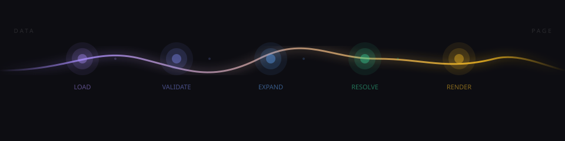

---

Peblor is a structured content runtime designed to be operated by an AI agent.

That sentence does a lot of work, so here's what it means in practice. You describe what you want. The AI translates your intent into structured data. The pipeline validates it, expands it, resolves assets, and renders a page. You never touch a JSON file unless you want to.

The complexity — and there is complexity — is the reason it works. 25+ element types, 55+ trigger actions, a full motion system, 17 trigger sources, recursive preset composition. This surface area would be overwhelming for a human to navigate. An AI navigates it fine. The schema is what gives the AI reliable footing: every operation is validated, every error is structured, every page is a pure function of its data. The AI can't ship a broken page without being told exactly what's broken.

## The interface

The MCP server is the primary way to interact with Peblor. Connect it to your AI assistant and describe what you want to build.

```json
// .mcp.json
{
  "mcpServers": {
    "peblor": {
      "command": "npm",
      "args": ["run", "pb-mcp"],
      "cwd": "."
    }
  }
}
```

From there: open a page session, describe a section, apply changes, validate, commit. The AI handles the rest. The studio app and CLI exist for inspection and development — they're not the editing path.

## What's already been solved

This is the part that matters if you're evaluating whether to build on this. The annoying parts of web development — the ones you usually defer until the night before launch — are handled at the schema and pipeline level. Not as bolt-ons. As first-class constraints.

**Accessibility.** Semantic HTML is enforced by the schema, not left to the author. Headings have a `semanticLevel` field — separate from the visual `level` — so you can render an h1-styled heading at the correct h2 position in the document outline without either fighting the design or breaking screen reader navigation. Lists are `<ul>/<ol>`. Blockquotes are `<blockquote>`. Tables are `<table>`. ARIA attributes are an explicit schema field on every element, not an escape hatch you add later. Modals have focus traps, `aria-modal`, and `aria-label` as first-class properties. `prefers-reduced-motion` is respected by marquees, infinite scroll, counters, and scroll-driven effects — detected per-element, not globally. You don't add accessibility to a Peblor page. It's the default.

**Performance.** Pages are fully SSG — every section, element, preset, module, and asset resolved at build time. No client-side data fetching. No layout shift from late-loading content. Images get a full srcset ladder, computed dimensions, format selection, and SVG blur placeholders precomputed and inlined — not deferred to a `<Suspense>` boundary. Rich text is precompiled from Markdown to HTML at build time. Button loop animations are precompiled to `@keyframes` CSS. Theme strings are precompiled to CSS `light-dark()` functions. By the time a byte leaves the server, the work is done.

**Theming.** Any color anywhere in the schema can be `{ light: "#fff", dark: "#111" }`. The pipeline compiles these to `light-dark()` CSS functions. A theme-reading `<script>` runs before first paint. Zero flicker. No JavaScript theme resolution on the client. No flash of wrong theme. Not "we handle dark mode" — we handle it in a way that doesn't compromise rendering performance.

**Motion.** The entire framer-motion API surface is available as declarative JSON. Entrance presets, exit presets, gesture bindings, scroll-driven parallax, pointer-following backgrounds, looping background effects, stagger children, viewport thresholds, reduced-motion policies. You don't install animation libraries and wire them up. You describe what you want in data.

**Responsive layout.** Six breakpoint tiers (base/sm/md/lg/xl/2xl) plus container queries, defined in the schema, emitted as CSS `@media` rules by the server component. Zero JavaScript breakpoint calculation on the client. The runtime doesn't compute breakpoints — the browser does, with precomputed CSS.

**Interactions.** 55+ trigger actions covering navigation, state management, media control, Three.js scene manipulation, Rive animation, browser APIs, and a full conditional sub-language (if/then/else, fireMultiple with parallel/sequence modes, repeatAction, waitFor with timeout branches). 17 trigger sources: IntersectionObserver, keyboard, timer, cursor proximity, scroll direction, idle detection, variable watchers, tab visibility, media progress, custom DOM events. A complete interactive experience without a line of JavaScript.

**Media.** HLS adaptive streaming with configurable quality presets. HMAC-signed CDN URLs with time-bucketed expiry. A local HLS dev server that converts video to adaptive bitrate for preview. Key bindings, gesture regions, seek behavior, chapter markers — all declarative configuration.

## What the pipeline gives you



Five stages. Each is a pure function.

```
LOAD      — discover files, merge presets, resolve inline references
VALIDATE  — Zod safeParse against the full schema, structured diagnostics
EXPAND    — inline elements, resolve modules, apply defaults, precompile motion
RESOLVE   — collect assets, sign CDN URLs, compute responsive image sizes
RENDER    — React dispatches via type-string lookup, SSG output
```

The pipeline is framework-agnostic through RESOLVE. Packages `core` and `contracts` have zero React dependencies.

## What you get to focus on

Not performance. Not accessibility. Not theming. Not animation infrastructure. Not media pipelines. Not responsive layout engines.

The content. What you're building, not the machinery that makes it work.

That's the actual pitch.

## Try it

```bash
npm install
npm run dev        # Demo app + dev tools
npm run check      # Full CI suite before pushing
```

[Docs](docs/about-these-docs.md) — [Architecture](docs/architecture/overview.md) — [Content authors](docs/content-authors/getting-started.md) — [System](docs/system/monorepo-map.md)
