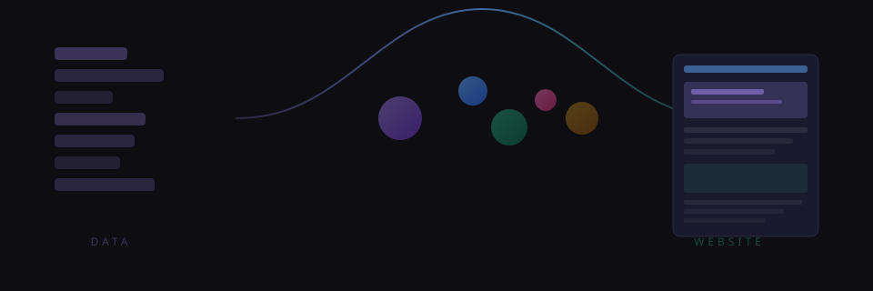

---

You describe the site you want. An AI builds it. Peblor handles everything else.

No code. No config. No boilerplate. No fighting CSS. No wiring up state management. No "I'll fix the accessibility before launch." You talk to your AI assistant. Pages come out the other side. Production quality, every time.

## How it works — from your perspective

You say something like _"make a landing page with a hero, three feature cards, and a footer."_ Your AI assistant opens a Peblor page session, writes the page as structured data, validates it, and commits it. You see the result. If you want the heading bigger or the cards in a different order, you say so. The AI handles the edits.

You never open a JSON file. You never write a line of CSS. You never configure a build tool. The AI navigates the full surface area so you don't have to.


The schema is what makes this reliable. Every operation is validated. Every error is structured. The AI can't ship a broken page without being told exactly what's broken. You get the creative freedom of vibe coding with the safety net of a type system.

## Connect it

Point your AI assistant at Peblor's MCP server and start building.

```json
// .mcp.json
{
  "mcpServers": {
    "peblor": {
      "command": "npm",
      "args": ["run", "pb-mcp"],
      "cwd": "."
    }
  }
}
```

That's the only config file you'll ever see. The studio app and CLI exist for inspection and development — they're not the editing path. The conversation is the editor.

## What comes standard

You don't bolt these on later. They're enforced by the schema, not left to chance.

**Accessibility.** Semantic HTML is the default — correct heading outlines, proper list and table structures, ARIA attributes on every element, focus-trapped modals, `prefers-reduced-motion` respected everywhere. You don't add accessibility to a Peblor page. It's there from the first build.


**Performance.** Every page is fully pre-built at deploy time — all 94 pages ship as static HTML. No client-side data fetching. No layout shift. Images get responsive srcsets, dimensional hints, and SVG blur placeholders — all computed and inlined before a byte reaches the browser. Rich text is precompiled from Markdown. Animations are precompiled to CSS keyframes. By the time the page loads, the work is done. Full CI validation across 1,897 tests completes in under two minutes.

**Dark mode.** Any color anywhere can be `{ light: "#fff", dark: "#111" }`. Compiled to native CSS `light-dark()` functions. Theme resolution runs before first paint. Zero flicker. Zero JavaScript.

**Motion.** Framer-motion's full API surface, available declaratively — entrance presets, gestures, scroll-driven parallax, pointer-following backgrounds, stagger sequences, reduced-motion policies. 264 presets cover the common cases. You describe the feel. The page moves.

**Responsive layout.** Six breakpoint tiers plus container queries. Emitted as CSS `@media` rules. No JavaScript measuring the viewport. The browser handles it natively.

**Interactions.** 27 trigger sources — click, hover, focus, keyboard, scroll direction, idle detection, timers, variable watchers, tab visibility, media events, and more. 120 declarative actions — navigation, state management, media control, conditional logic, API calls, clipboard, focus traps, toast notifications. Complex interactive behavior without a line of JavaScript.

**Media.** Adaptive streaming, signed CDN URLs, responsive images, chapter markers, gesture regions. 11 media modules handle video, audio, 3D models, Rive animations, and Lottie. Described in data, delivered by the platform.

## Try it

```bash
npm install
npm run dev
```

Describe a page to your AI. Watch it land.

[Docs](docs/about-these-docs.md) — [Architecture](docs/architecture/overview.md) — [Content authors](docs/content-authors/getting-started.md) — [System](docs/system/monorepo-map.md)
